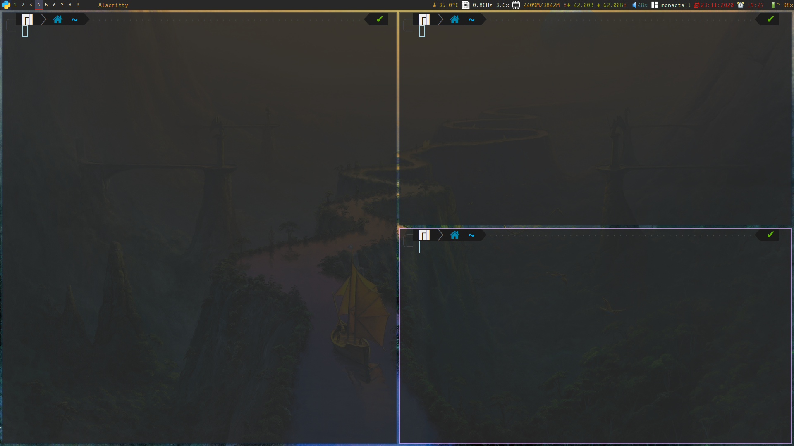

# My minimalist qtile configuration



### Dependencies
-------------------------
| Compositor | picom    |
| ---        | ---      |
| Wallpaper  | nitrogen |
-------------------------

### Nice feature
* ["window swallowing"](https://dwm.suckless.org/patches/swallow/)

```
# works only for programs listed here
# if you want to add or remove programs
# modify the "terminals" list
def is_terminal(window_cmd):
    # list of programs that will be hidden when a
    # child process (that opens a window) is spawned
    # it's called terminals because I only use it
    # for terminal emulators
    terminals = ["alacritty", "st", "gnome-terminal"]
    return window_cmd in terminals

@hook.subscribe.client_new
def _swallow(window):
    # pid of current window
    pid = window.window.get_net_wm_pid()

    # parents of the process running in the current window
    parents = psutil.Process(pid).parents()
    if parents == []:
        return

    # dictionary {pid: window} to access all windows by pid
    cpids = {c.window.get_net_wm_pid(): wid for wid,
             c in window.qtile.windows_map.items()}

    # find the first parent that has a window opened then minimize it
    # parents are sorted in reverse pid order, feel free to check out
    for i in parents:
        if i.pid in cpids and is_terminal(i.name()):
            # find parent and minimize it
            parent = window.qtile.windows_map.get(cpids[i.pid])
            if not parent.minimized: # make sure it wasn't swallowed by another process
                parent.minimized = True
                # set parent attribute to current window
                window.parent = parent
                return

@hook.subscribe.client_killed
def _unswallow(window):
    if hasattr(window, 'parent'):
        window.parent.minimized = False
```
